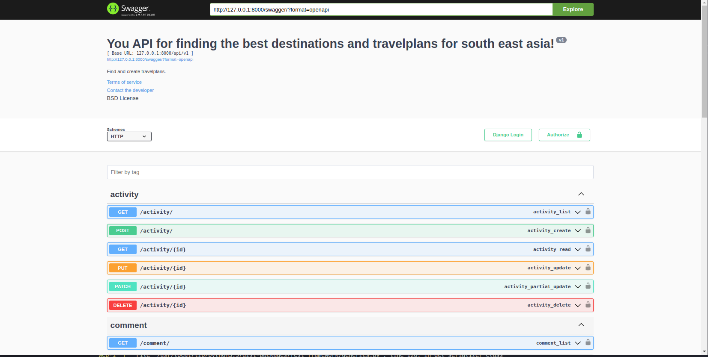
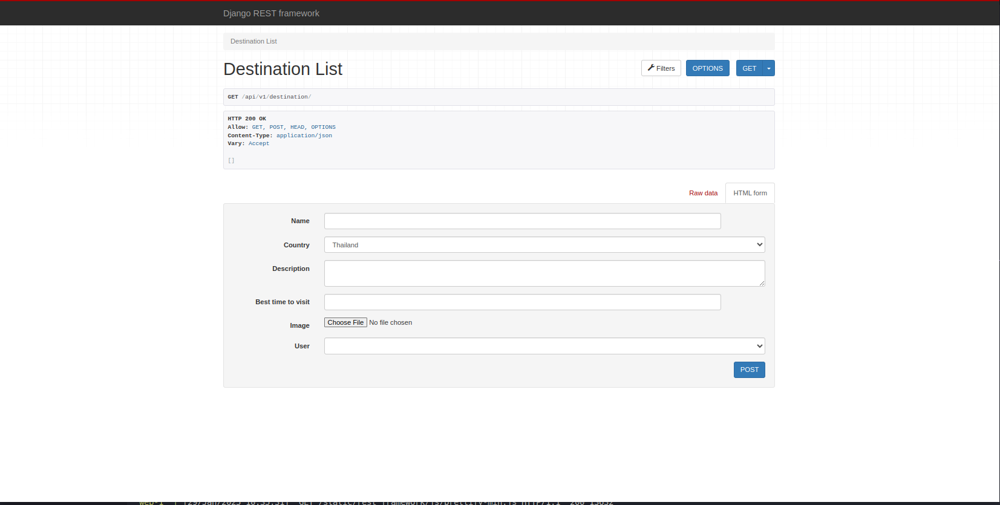

# Travelplanner-Southeast-Asia

This is an API project created during our Backend Programming course.  
A simple Travelplanner API designed to deliver data from our PostgreSQL database for Frontend Developers.

## Features:
- **Django Rest Framework** for building the API.
- **Token Authentication** for secure access.
- **AI Integration** to automatically generate descriptions for locations.
- **Dockerized** for easy deployment (using Docker).
- **Swagger Interface** for interactive API documentation.

## Installation

To set up the project locally, follow these steps:

1. Clone the repository:
    ```bash
    git clone <repository-url>
    ```

2. Navigate to the project folder:
    ```bash
    cd Travelplanner-Southeast-Asia
    ```

3. Build and start the Docker containers:
    ```bash
    docker compose up --build
    ```

4. Once the containers are up, you can access the API at:
    - API: `http://localhost:8000`
    - Swagger docs: `http://localhost:8000/swagger/`

## Authentication

This project uses **Token Authentication** for secure access to the API. To authenticate, follow these steps:

1. Create a user via the `/register/` endpoint.
2. Retrieve the authentication token from the `/token/` endpoint.
3. Use the token in your `Authorization` header for authenticated requests.

## AI Feature

The AI integration automatically generates descriptions for destinations when added to the system. This feature leverages **groq** to provide dynamic and meaningful descriptions for travel destinations.

## Technologies Used:
- **Django** and **Django Rest Framework** for the backend.
- **PostgreSQL** as the database.
- **Docker** for containerization.
- **Swagger** for API documentation.
- **AI model (groq)** for automatic description generation.




